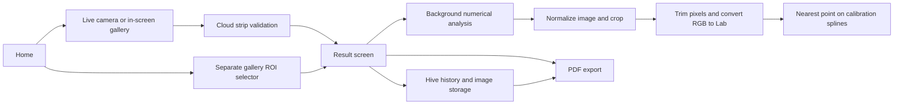

# pH Analyzer production-readiness review

> Historical review of the original prototype. Code and line references below describe the pre-fix state. See [implementation status](IMPLEMENTATION_STATUS.md) for changes and verification completed on 18 September 2026.

Reviewed 17 September 2026. Assessment: a working prototype with useful separation of numerical services, but not ready to present measurements as dependable production results. Prioritize measurement integrity, trustworthy capture, cloud security, and recovery before adding features.

## What the app does

Flutter mobile app with camera/gallery capture, manually selected dye/reference regions, CIELAB color conversion, eight bundled calibration anchors, natural cubic splines, local history, and PDF sharing. The numerical estimate is computed locally in an isolate. The live capture screen first sends a JPEG crop to Gemini to classify whether it resembles a test strip. This is not a validation of pH accuracy.

Graph navigation identified separate capture, prediction, cloud validation, storage, export, and UI communities. `PredictionRecord` bridges persistence, the adapter, tests, and history screens. These architecture descriptions were checked against source; the undirected graph is not a runtime call trace.

## Verification and limits

- `flutter analyze --no-pub`: no issues.
- `flutter test --no-pub`: all 18 existing tests passed.
- Two temporary audit probes confirmed: a custom calibration whose lower anchor is pH 4 returns pH 0 for that exact anchor; RGB `[40,200,60]` receives pH 11.6 under the bundled calibration without a distance-based rejection.
- Existing tests cover numerical pieces, synthetic image cases, Hive serialization, validator response/retry behavior, and basic widgets. They do not establish real-world measurement accuracy or exercise a physical camera.
- No production source was changed. No live Gemini request, release build, store submission, physical-device camera test, or calibrated laboratory comparison was performed. Secret values were not read.
- Graph: 119 detected files, 836 nodes, 966 edges, 92 communities. Health warnings: 43 dangling endpoint edges and 7 undirected same-endpoint collapses (4 in directed accounting); one Linux header extraction error. Asset filename stems can collide. Automated rankings overemphasize native scaffolding and icons; they are not an architectural quality score.
- Worker token accounting is unavailable. Graphify's zero token fields are placeholders, not actual zero usage. Its 37.7x retrieval benchmark is an estimate, not a measured correctness improvement.

## Must fix before a public release

### 1. Remove invented confidence and unsupported precision claims

Evidence: [home_screen.dart:732](/Users/rithvick/StudioProjects/pH_analyzer/lib/screens/home_screen.dart:732) passes `confidence: 94` for every recent record. [ph_analyzer.dart:149](/Users/rithvick/StudioProjects/pH_analyzer/lib/services/ph_analyzer.dart:149) searches at 0.1 pH increments and returns only a number. [result_screen.dart:859](/Users/rithvick/StudioProjects/pH_analyzer/lib/screens/result_screen.dart:859) says “exact pH.”

Remove the percentage until it is statistically validated. Present an estimated pH with honest resolution; decimal formatting is not accuracy. Return a structured measurement with quality flags and calibration identity. A distance score may help reject bad fits, but must not be relabeled a probability without validation.

Acceptance: no constant confidence; results, history, and PDFs preserve the same uncertainty and quality status.

### 2. Validate the measurement system and allow “cannot determine”

Evidence: [assets/calibration.json](/Users/rithvick/StudioProjects/pH_analyzer/assets/calibration.json) contains eight anchors and one constant background RGB. [ph_analyzer.dart:136](/Users/rithvick/StudioProjects/pH_analyzer/lib/services/ph_analyzer.dart:136) checks dye luminance, then always selects the closest spline point. It does not reject large color residuals or ambiguous matches. The temporary green-color probe confirms that a number is returned; it does not itself establish what the correct pH should be.

Collect a held-out dataset with reference measurements across supported strip brands/lots, pH ranges, phones, illumination, and reaction times. Separate calibration samples from validation samples. Report error distributions, bias, repeatability, rejection rate, and uncertainty by operating condition. Define acceptance thresholds for the intended use before evaluating the release. Require or clearly qualify the reference-patch assumption. Add blur, saturation/glare, ROI-size, and patch-uniformity checks, and reject unsupported colors/ambiguous matches. Validate lighting checks independently of dye darkness.

Acceptance: a documented operating envelope, versioned calibration, reproducible validation results, and an explicit low-quality outcome instead of a forced number. No specific accuracy target is asserted by this review.

### 3. Fix image-to-preview coordinate consistency

Evidence: [live_camera_screen.dart:839](/Users/rithvick/StudioProjects/pH_analyzer/lib/screens/live_camera_screen.dart:839) displays raw gallery images with `BoxFit.cover`; [live_camera_screen.dart:444](/Users/rithvick/StudioProjects/pH_analyzer/lib/screens/live_camera_screen.dart:444) maps the ROI by simply multiplying normalized coordinates by full image dimensions. [ph_analyzer.dart:83](/Users/rithvick/StudioProjects/pH_analyzer/lib/services/ph_analyzer.dart:83) additionally rotates every landscape image after EXIF normalization. The preview and analyzed pixels can therefore differ in both crop and orientation. The separate ROI selector already has a more explicit scale/offset transform.

Use one normalized image and one explicit transform from image pixels to displayed pixels, including cover crop, scale, orientation, and any mirroring. Invert that transform for every ROI. Use the same crop function for validation, prediction, thumbnails, and PDF annotations.

Acceptance: marked synthetic images verify selected-pixel identity for portrait/landscape, EXIF rotations, gallery/camera, and mismatched aspect ratios; then verify on actual supported phones.

### 4. Never substitute demo data after camera failure

Evidence: [live_camera_screen.dart:174](/Users/rithvick/StudioProjects/pH_analyzer/lib/screens/live_camera_screen.dart:174) swallows camera initialization failures and prepares the mock image. [live_camera_screen.dart:425](/Users/rithvick/StudioProjects/pH_analyzer/lib/screens/live_camera_screen.dart:425) uses that image when live capture is unavailable, while [live_camera_screen.dart:960](/Users/rithvick/StudioProjects/pH_analyzer/lib/screens/live_camera_screen.dart:960) can still show camera-mode guidance.

Show permission-denied, unavailable-camera, initialization-failed, and retry/settings states. Demo mode must be explicit and persist a demo flag through history/export. Disable real measurement capture until a genuine source is ready.

Also handle application lifecycle: release camera resources when inactive and recreate them after resume; dispose a controller whose initialization completes after the screen has been left. The [camera plugin documentation](https://pub.dev/packages/camera) assigns lifecycle handling to the application.

Acceptance: denied permission, navigation during initialization, background/resume, interruptions, and no-camera devices never silently create a demo measurement.

### 5. Secure cloud validation and correct the offline promise

Evidence: [pubspec.yaml:92](/Users/rithvick/StudioProjects/pH_analyzer/pubspec.yaml:92) bundles `.env`; [live_camera_screen.dart:501](/Users/rithvick/StudioProjects/pH_analyzer/lib/screens/live_camera_screen.dart:501) reads a Gemini key into the client; [strip_validator_service.dart:89](/Users/rithvick/StudioProjects/pH_analyzer/lib/services/strip_validator_service.dart:89) sends image bytes. README says “100% Offline”; [export_service.dart:265](/Users/rithvick/StudioProjects/pH_analyzer/lib/services/export_service.dart:265) says “Zero-Cloud Edge Computing.” Ignoring `.env` in Git does not prevent its inclusion in a built asset bundle.

Choose an explicit product mode: truly local validation, or disclosed cloud-assisted validation. For cloud mode, use an authenticated backend with server-held credentials, request limits, payload limits, and spend controls, or a suitably protected managed client integration. Inspect release bundles for credentials; rotate any real key already distributed. Explain what image crop leaves the device and give the user control before upload.

Google states that [production clients must not expose Gemini keys](https://ai.google.dev/gemini-api/docs/api-key). The current [`google_generative_ai` Dart SDK is no longer maintained](https://ai.google.dev/gemini-api/docs/libraries); plan a supported migration and validate the configured model in a staging contract test. No live model-availability claim was verified here.

Acceptance: no Gemini secret in the app bundle; clear cloud disclosure; reliable behavior when cloud access is unavailable.

### 6. Make validation consistent and persistent across entry points

Evidence: [roi_selector.dart:190](/Users/rithvick/StudioProjects/pH_analyzer/lib/screens/roi_selector.dart:190) navigates directly to results. Live capture invokes the validator. [live_camera_screen.dart:541](/Users/rithvick/StudioProjects/pH_analyzer/lib/screens/live_camera_screen.dart:541) shows transport fallback only in a short snackbar, then passes no validation status into `ResultScreen`. [prediction_record.dart:3](/Users/rithvick/StudioProjects/pH_analyzer/lib/models/prediction_record.dart:3) has no validation/provenance fields.

Create a single analysis workflow shared by camera and gallery. Represent accepted, rejected, unavailable, failed, and demo states explicitly. Preserve status, reason, model version where applicable, and timestamp in the result, record, and PDF. Provide cancellable progress and a deliberate offline option rather than up to two 20-second waits.

Acceptance: the same image gets the same policy through every entry point; an unvalidated result remains visibly unvalidated after saving and sharing.

### 7. Make calibration input strict and respect its supported domain

Evidence: [calibration_data.dart:15](/Users/rithvick/StudioProjects/pH_analyzer/lib/models/calibration_data.dart:15) mostly casts JSON fields. Splines clamp inputs to their endpoints at [cubic_spline.dart:70](/Users/rithvick/StudioProjects/pH_analyzer/lib/services/cubic_spline.dart:70), while the predictor always searches 0–14. With anchors at pH 4 and 10, every candidate below 4 has the same endpoint color; the first match wins, so the pH 4 anchor is reported as pH 0. This was reproduced in a temporary test. The bundled full-range calibration does not trigger that particular boundary defect.

Require finite pH values in the supported range, exactly three integer RGB channels within 0–255, unique anchors, valid ordering, and enough coverage. Search only the calibrated domain and expose out-of-range results. Validate into an immutable model before replacing the active calibration. Add a schema version, calibration ID/hash, strip/lot identity, and provenance.

Acceptance: restricted-range endpoint tests and malformed calibration tests pass; existing full-range behavior remains covered.

## Next production hardening work

### 8. Reliable history and reproducible reports

[history_service.dart:60](/Users/rithvick/StudioProjects/pH_analyzer/lib/services/history_service.dart:60) turns all read failures into an empty history. Startup similarly ignores storage and calibration initialization failures. A save copies an image before writing its record, with no rollback; a missing source image can still produce a saved record.

Surface storage errors separately from empty history, provide recovery, use UUID image names and relative paths, roll back failed saves, and clean orphan/temporary images. Add schema migrations. Store captured RGB/Lab, quality status, calibration/algorithm versions, image dimensions/orientation, and capture source alongside the result. Export that immutable measurement snapshot. [export_service.dart:106](/Users/rithvick/StudioProjects/pH_analyzer/lib/services/export_service.dart:106) uses export time; distinguish original measurement time from report generation time.

Acceptance: storage-full, missing-file, interrupted-save, old-schema, and corrupted-store scenarios preserve data or explain recovery. Old records remain interpretable after calibration updates.

### 9. Reduce duplication and memory pressure

Keep the useful numerical service/isolate separation. Extract capture/analysis orchestration from the 1,342-line live screen and 871-line results screen into testable controllers or view models. Use typed immutable inputs/results rather than loosely typed maps. Inject camera, validator, storage, and clock dependencies; no particular state-management framework is required.

The live path repeatedly decodes the full image for dimensions, validation crop, prediction, and thumbnails. Decode/normalize once per measurement, process bounded ROIs, and return one complete result with thumbnail bytes. Profile before optimization, particularly large gallery images and low-memory phones. Add bounded image-size limits and cancellation. Centralize repeated pH category/color logic.

### 10. Release engineering and diagnostics

[android/app/build.gradle.kts:24](/Users/rithvick/StudioProjects/pH_analyzer/android/app/build.gradle.kts:24) retains `com.example.ph_analyzer`; its release build uses debug signing at line 37. Use the intended application ID, release signing, reproducible versioning, and separate development/staging/production configuration. Decide which platforms are supported: scaffold directories do not prove support, and shared code uses native file APIs while camera initialization only targets Android/iOS.

Add CI for formatting checks, static analysis, existing tests, image geometry and calibration regressions, and release builds for supported targets. Add integration tests for capture → analysis → save → reopen → export and fault scenarios. Validate on physical iOS/Android devices. Record actionable crashes/errors and stage timing without logging images, secrets, or user notes. The present global error handlers mainly print diagnostics.

Acceptance: reproducible signed release artifacts, a device test matrix, actionable failure reporting, and a staged rollout/rollback process.

### 11. Usability and accessibility

Provide first-run strip/reference guidance, explicit quality feedback and retake advice, and a strip-specific reaction timer once supported instructions are defined. Make ROI selection usable through controls in addition to drag gestures. Check screen readers, large text, contrast, touch target sizes, reduced motion, and small-screen layouts. Replace hard-coded camera-ready status with actual readiness. Keep dark/light styling consistent and make sample names/notes easy to retrieve. Test long/unicode notes in PDFs and tablet sharing. Refresh home history after every completed save flow.

## Suggested implementation order

1. Trust/correctness patch: remove fake confidence and exactness claims; fix demo fallback, ROI transforms, and calibration-domain bug; retain validation status everywhere.
2. Measurement/security milestone: define supported strips and operating conditions; collect independent validation data; settle local/cloud behavior; remove bundled secrets and migrate cloud integration.
3. Reliability milestone: shared workflow/controller, immutable measurement schema, storage recovery/migrations, decode-once processing, camera lifecycle handling.
4. Release milestone: CI, physical-device integration tests, release signing/IDs, accessible capture UX, operational diagnostics, and a staged beta.

A backend account system or synchronization is not required for the app's core local measurement purpose. Add those only if a real product requirement calls for them.
